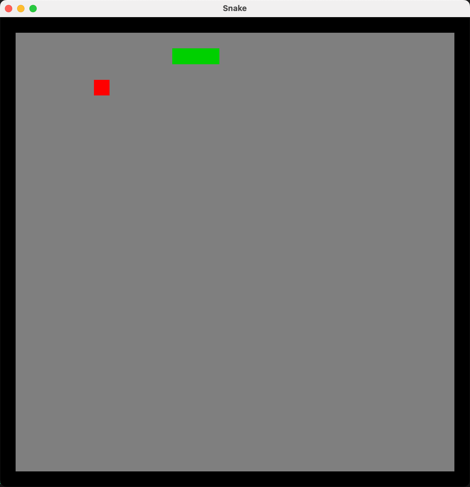

# Rust 小项目

## Rust贪吃蛇游戏 -- snake_game2

一个使用Rust和Piston游戏引擎开发的经典贪吃蛇游戏。

### 游戏截图



## Rust 端口扫描程序 -- port_scanner_async

扫描一台设备开放了哪些端口

```bash
➜  port_scanner_async git:(main) ✗ cargo run -- --ip 127.0.0.1 --ports 1-65535 --timeout 500
开始扫描 127.0.0.1:1-65535
发现开放端口：53
发现开放端口：5000
发现开放端口：7897
发现开放端口：7000
发现开放端口：8021
发现开放端口：14013
发现开放端口：14019
发现开放端口：14016
发现开放端口：14022
发现开放端口：14023
发现开放端口：33331
发现开放端口：51000
发现开放端口：51001
发现开放端口：51002
发现开放端口：51004
发现开放端口：51006
发现开放端口：51007
发现开放端口：59520
发现开放端口：60156
发现开放端口：59814
扫描完毕！...
```

## Rust DNS测试程序 -- dns_test_async

DNS服务器延迟测试

```bash
🚀 开始 DNS 延迟基准测试...
待测服务器: 7 个, 待测域名: 4 个

DNS Server       | Domain               | Status     | Latency    | Result / Error
------------------------------------------------------------------------------------------
1.1.1.1          | github.com           | SUCCESS    | 8010 ms    | IP: "?"...
1.1.1.1          | www.baidu.com        | SUCCESS    | 8010 ms    | IP: "?"...
1.1.1.1          | www.google.com       | SUCCESS    | 8010 ms    | IP: "?"...
1.1.1.1          | rust-lang.org        | SUCCESS    | 8010 ms    | IP: "?"...
------------------------------------------------------------------------------------------
1.2.3.4          | rust-lang.org        | SUCCESS    | 8010 ms    | IP: "?"...
1.2.3.4          | www.google.com       | SUCCESS    | 8010 ms    | IP: "?"...
1.2.3.4          | www.baidu.com        | SUCCESS    | 8010 ms    | IP: "?"...
1.2.3.4          | github.com           | SUCCESS    | 8010 ms    | IP: "?"...
------------------------------------------------------------------------------------------
114.114.114.114  | github.com           | SUCCESS    | 34 ms      | IP: "20.205.243.166"...
114.114.114.114  | www.baidu.com        | SUCCESS    | 34 ms      | IP: "183.2.172.177"...
114.114.114.114  | rust-lang.org        | SUCCESS    | 34 ms      | IP: "185.199.109.153"...
114.114.114.114  | www.google.com       | SUCCESS    | 39 ms      | IP: "31.13.94.10"...
------------------------------------------------------------------------------------------
119.29.29.29     | github.com           | SUCCESS    | 14 ms      | IP: "20.205.243.166"...
119.29.29.29     | www.google.com       | SUCCESS    | 16 ms      | IP: "199.59.148.96"...
119.29.29.29     | www.baidu.com        | SUCCESS    | 16 ms      | IP: "183.2.172.17"...
119.29.29.29     | rust-lang.org        | SUCCESS    | 19 ms      | IP: "185.199.108.153"...
------------------------------------------------------------------------------------------
180.76.76.76     | www.google.com       | SUCCESS    | 15 ms      | IP: "31.13.73.9"...
180.76.76.76     | github.com           | SUCCESS    | 15 ms      | IP: "20.205.243.166"...
180.76.76.76     | www.baidu.com        | SUCCESS    | 15 ms      | IP: "183.2.172.177"...
180.76.76.76     | rust-lang.org        | SUCCESS    | 84 ms      | IP: "185.199.108.153"...
------------------------------------------------------------------------------------------
223.5.5.5        | www.google.com       | SUCCESS    | 16 ms      | IP: "31.13.94.37"...
223.5.5.5        | github.com           | SUCCESS    | 16 ms      | IP: "20.205.243.166"...
223.5.5.5        | www.baidu.com        | SUCCESS    | 16 ms      | IP: "183.2.172.177"...
223.5.5.5        | rust-lang.org        | SUCCESS    | 76 ms      | IP: "185.199.110.153"...
------------------------------------------------------------------------------------------
8.8.8.8          | www.google.com       | SUCCESS    | 9 ms       | IP: "31.13.73.169"...
8.8.8.8          | github.com           | SUCCESS    | 168 ms     | IP: "20.205.243.166"...
8.8.8.8          | rust-lang.org        | SUCCESS    | 168 ms     | IP: "185.199.109.153"...
8.8.8.8          | www.baidu.com        | SUCCESS    | 172 ms     | IP: "103.235.46.102"...
```

## Rust SOCKS5 代理 -- proxy

使用rust实现的SOCKS5协议
